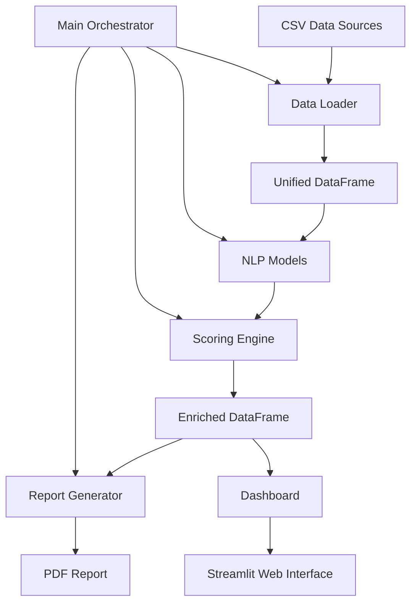

# Design Document

## Overview

The Advanced Trade Insight Engine MVP is a Python-based data analysis system that processes multi-channel customer feedback through a modular pipeline architecture. The system transforms disparate CSV data sources into actionable business insights via automated scoring, report generation, and interactive visualization.

The architecture follows a clear separation of concerns with five core modules: data ingestion, NLP processing, impact scoring, report generation, and dashboard presentation. This design enables independent testing, maintenance, and future enhancement of each component.

## Architecture

### System Architecture Diagram



### Data Flow

1. **Ingestion Phase**: CSV files are loaded and normalized into a unified DataFrame structure
2. **Enrichment Phase**: NLP models extract sentiment, themes, and strategic alignment
3. **Scoring Phase**: Impact scores are calculated using business logic and source weighting
4. **Output Phase**: Results are formatted into PDF reports and interactive dashboards

### Technology Stack

- **Core Processing**: Python 3.9+, Pandas for data manipulation
- **Visualization**: Streamlit for interactive dashboard
- **Reporting**: FPDF2 for PDF generation
- **Data Storage**: In-memory DataFrames (CSV file-based for MVP)

## Components and Interfaces

### 1. Data Loader Module (`data_loader.py`)

**Purpose**: Normalize disparate CSV sources into unified DataFrame structure

**Key Function**:
```python
def load_and_normalize_data(file_paths: dict) -> pd.DataFrame
```

**Input**: Dictionary mapping source names to file paths
**Output**: Unified DataFrame with standardized columns

**Column Mapping Strategy**:
- `feedback_text`: Unified from review_text, tweet_text, note_text
- `author_handle`: Unified from username, handle, account_name
- `source_channel`: Added to identify data origin
- Source-specific metrics preserved: rating, likes, followers, ARR_impact_estimate_USD

**Error Handling**: Graceful handling of missing files, malformed CSV data

### 2. NLP Models Module (`nlp_models.py`)

**Purpose**: Extract semantic information from feedback text

**Key Functions**:
```python
def get_sentiment(record: pd.Series) -> str
def get_theme(record: pd.Series) -> str  
def get_strategic_goal(record: pd.Series) -> str
```

**MVP Implementation**: Pass-through functions using pre-enriched CSV data
**Future Enhancement**: Integration with actual NLP models (BERT, GPT, etc.)

**Supported Categories**:
- **Sentiments**: positive, negative, neutral
- **Themes**: Trading/Execution & Fees, Performance/Outages, Support Experience, etc.
- **Strategic Goals**: Growth, Trust&Safety, Onchain Adoption, CX Efficiency, Compliance

### 3. Scoring Engine Module (`engine.py`)

**Purpose**: Calculate business impact scores for prioritization

**Key Functions**:
```python
def calculate_source_weight(record: pd.Series) -> float
def calculate_impact_score(record: pd.Series, source_weight: float) -> float
```

**Source Weighting Logic**:
- Internal Sales Notes: `ARR_impact_estimate_USD / 50000`
- Twitter: `followers / 20000`
- App Stores: `rating + (helpful_votes / 10)`
- Default: `1.0`

**Impact Score Formula**:
```
Impact Score = (sentiment_value × severity) × source_weight × strategic_multiplier
```

**Sentiment Values**: negative=1.5, neutral=0.5, positive=0.1
**Strategic Multiplier**: aligned_goals=2.0, others=1.0

### 4. Report Generator Module (`report_generator.py`)

**Purpose**: Create structured business reports from analyzed data

**Key Functions**:
```python
def generate_report_content(df: pd.DataFrame) -> dict
def create_pdf_report(report_content: dict, file_path: str) -> None
```

**Report Structure**:
- Executive Summary with key metrics
- Top 3 Pain Points (highest negative impact)
- Top 3 Praised Features (highest positive sentiment + impact)
- Strategic Goal Spotlight
- Theme-based Impact Rankings

**PDF Layout**: Professional formatting with clear sections, charts, and actionable insights

### 5. Dashboard Module (`dashboard.py`)

**Purpose**: Interactive data exploration interface

**Streamlit Components**:
- KPI Header: Total items, average sentiment, top theme
- Interactive Charts: Theme impact rankings, sentiment distribution
- Filterable Data Table: Sort by impact score, filter by source/theme
- Time-based Analysis: Trend visualization over time periods

**User Interactions**:
- Dynamic filtering by source channel, theme, sentiment
- Sortable columns for custom prioritization
- Drill-down capabilities for detailed feedback review

### 6. Main Orchestrator (`main.py`)

**Purpose**: Coordinate end-to-end pipeline execution

**Execution Flow**:
1. Load and validate input file paths
2. Execute data normalization
3. Apply NLP enrichment
4. Calculate impact scores
5. Generate PDF report
6. Prepare dashboard data
7. Provide execution status and output locations

## Data Models

### Unified DataFrame Schema

| Column | Type | Description | Source |
|--------|------|-------------|---------|
| customer_id | string | Unique identifier | All sources |
| source_channel | string | Data origin identifier | Added during normalization |
| feedback_text | string | Normalized feedback content | review_text, tweet_text, note_text |
| author_handle | string | User identifier | username, handle, account_name |
| timestamp | datetime | Feedback creation time | All sources |
| sentiment | string | Sentiment classification | Pre-enriched |
| theme | string | Feedback categorization | Pre-enriched |
| strategic_goal | string | Business alignment | Pre-enriched |
| severity | float | Issue severity score | Pre-enriched |
| source_weight | float | Calculated source credibility | Calculated |
| impact_score | float | Business impact priority | Calculated |

### Source-Specific Fields

**App Store Reviews**: rating, helpful_votes, region, device, app_version
**Twitter Mentions**: followers, verified, likes, retweets, reply_count
**Internal Sales**: ARR_impact_estimate_USD, account_type, deal_stage, requested_feature

## Error Handling

### Data Loading Errors
- Missing CSV files: Log warning, continue with available data
- Malformed CSV: Skip problematic rows, log details
- Empty datasets: Provide meaningful error messages

### Processing Errors
- Missing required fields: Use default values, log warnings
- Calculation failures: Skip record, continue processing
- Memory constraints: Implement chunked processing for large datasets

### Output Errors
- PDF generation failures: Log error, continue with dashboard
- Dashboard startup issues: Provide troubleshooting guidance
- File permission errors: Clear error messages with resolution steps

## Testing Strategy

### Unit Testing
- **Data Loader**: Test CSV parsing, column mapping, error handling
- **NLP Models**: Validate sentiment/theme extraction accuracy
- **Scoring Engine**: Verify calculation formulas and edge cases
- **Report Generator**: Test PDF creation and content formatting

### Integration Testing
- **End-to-End Pipeline**: Full workflow with sample data
- **Error Scenarios**: Missing files, corrupted data, calculation failures
- **Performance Testing**: Large dataset processing capabilities

### Test Data Strategy
- Use provided mock CSV files for consistent testing
- Create edge case datasets: empty files, missing columns, extreme values
- Validate output formats: PDF structure, dashboard functionality

### Validation Criteria
- Data integrity: No data loss during normalization
- Calculation accuracy: Impact scores match expected formulas
- Output quality: Reports contain expected insights and formatting
- Error resilience: System continues operation despite individual failures

## Code Organization and File Structure

### File Size Guidelines
- **Target**: Keep individual modules under 300-400 lines of code
- **Rationale**: Maintainable, testable, and readable code units
- **Refactoring Strategy**: Split large modules into focused sub-modules

### Proposed File Structure Refinements

```
/advanced-trade-insights-mvp/
├── data/
│   ├── coinbase_advance_apple_reviews.csv
│   ├── coinbase_advanceGoogle_Play.csv
│   ├── coinbase_advanced_twitter_mentions.csv
│   └── coinbase_advance_internal_sales_notes.csv
├── output/
│   └── weekly_insight_report.pdf
├── src/
│   ├── data_processing/
│   │   ├── __init__.py
│   │   ├── data_loader.py (~200 lines)
│   │   └── data_normalizer.py (~150 lines)
│   ├── analysis/
│   │   ├── __init__.py
│   │   ├── nlp_models.py (~100 lines)
│   │   ├── scoring_engine.py (~200 lines)
│   │   └── impact_calculator.py (~150 lines)
│   ├── reporting/
│   │   ├── __init__.py
│   │   ├── report_generator.py (~250 lines)
│   │   ├── pdf_formatter.py (~200 lines)
│   │   └── content_builder.py (~150 lines)
│   ├── dashboard/
│   │   ├── __init__.py
│   │   ├── dashboard.py (~300 lines)
│   │   ├── components.py (~200 lines)
│   │   └── charts.py (~150 lines)
│   └── utils/
│       ├── __init__.py
│       ├── config.py (~100 lines)
│       └── helpers.py (~150 lines)
├── tests/
│   ├── test_data_processing/
│   ├── test_analysis/
│   ├── test_reporting/
│   └── test_dashboard/
├── main.py (~150 lines)
└── requirements.txt
```

### Module Refactoring Strategy

**Data Processing Split**:
- `data_loader.py`: Core CSV loading and validation
- `data_normalizer.py`: Column mapping and DataFrame unification

**Analysis Split**:
- `nlp_models.py`: Sentiment, theme, and strategic goal extraction
- `scoring_engine.py`: Source weight calculation logic
- `impact_calculator.py`: Impact score computation and ranking

**Reporting Split**:
- `report_generator.py`: Main report orchestration
- `pdf_formatter.py`: PDF layout and styling
- `content_builder.py`: Data aggregation and insight generation

**Dashboard Split**:
- `dashboard.py`: Main Streamlit application
- `components.py`: Reusable UI components (KPIs, filters)
- `charts.py`: Visualization logic and chart generation

### Benefits of Refactored Structure
- **Maintainability**: Smaller, focused modules are easier to understand and modify
- **Testability**: Individual components can be tested in isolation
- **Reusability**: Common functionality can be shared across modules
- **Collaboration**: Multiple developers can work on different modules simultaneously
- **Debugging**: Issues can be isolated to specific functional areas

## Performance Considerations

### Memory Management
- Process data in chunks for large datasets
- Optimize DataFrame operations for memory efficiency
- Clear intermediate variables to prevent memory leaks

### Processing Speed
- Vectorized operations for scoring calculations
- Efficient grouping and aggregation for report generation
- Lazy loading for dashboard data presentation

### Scalability Preparation
- Modular design supports horizontal scaling
- Database integration points identified for future enhancement
- API endpoints planned for real-time data ingestion