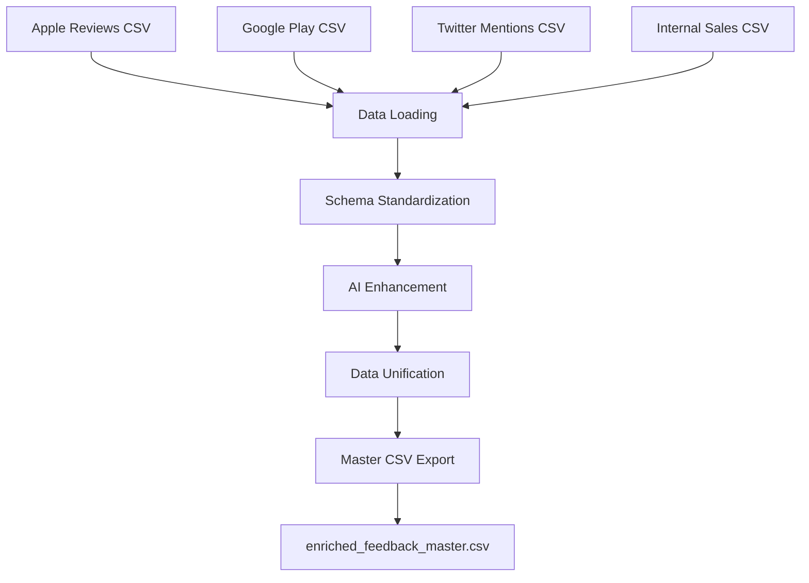

# Design Document

## Overview

The Feedback Enhancement System is a Python-based data processing pipeline that transforms raw, multi-channel customer feedback into a unified, strategically-aware dataset. The system leverages pandas for data manipulation and implements a modular architecture that can be integrated into the existing Advanced Trade Insight Engine infrastructure.

The system processes four distinct CSV data sources with different schemas and creates a single master CSV file with standardized columns, AI-driven sentiment scoring, and strategic alignment. This enhanced dataset serves as a foundation for data-driven decision-making and strategic analysis.

## Architecture

### System Architecture

The Feedback Enhancement System follows a single-script architecture that integrates seamlessly with the existing codebase structure:

```
feedback_enhancement_system.py
├── Data Loading Module
├── Schema Standardization Module  
├── AI Enhancement Module
├── Data Unification Module
└── Export Module
```

### Integration Points

The system integrates with the existing Advanced Trade Insight Engine at several levels:

1. **Data Layer**: Utilizes the same CSV data sources in `csv_mock_data/` directory
2. **Processing Layer**: Follows similar pandas-based data processing patterns as existing modules
3. **Output Layer**: Generates CSV output compatible with existing dashboard and reporting systems
4. **Configuration**: Leverages existing configuration patterns and directory structure

### Data Flow Architecture



## Components and Interfaces

### 1. Data Loading Component

**Purpose**: Load and validate all four CSV data sources

**Interface**:
```python
def load_csv_sources(data_directory: str) -> Dict[str, pd.DataFrame]
```

**Responsibilities**:
- Load each CSV file into separate pandas DataFrames
- Validate file existence and basic structure
- Handle missing files gracefully with error reporting
- Return dictionary mapping source names to DataFrames

**Error Handling**:
- FileNotFoundError for missing CSV files
- pd.errors.EmptyDataError for empty files
- pd.errors.ParserError for malformed CSV structure

### 2. Schema Standardization Component

**Purpose**: Transform each data source to conform to the unified schema

**Interface**:
```python
def standardize_apple_reviews(df: pd.DataFrame) -> pd.DataFrame
def standardize_google_reviews(df: pd.DataFrame) -> pd.DataFrame  
def standardize_twitter_mentions(df: pd.DataFrame) -> pd.DataFrame
def standardize_sales_notes(df: pd.DataFrame) -> pd.DataFrame
```

**Standardization Mapping**:

| Target Column | Apple/Google Source | Twitter Source | Sales Notes Source |
|---------------|-------------------|----------------|-------------------|
| feedback_id | customer_id + prefix | customer_id + prefix | customer_id + prefix |
| source_channel | "Apple App Store"/"Google Play Store" | "Twitter (X)" | "Internal Sales Notes" |
| timestamp | timestamp | timestamp | timestamp |
| feedback_text | review_text | tweet_text | note_text |
| source_metric | helpful_votes | followers | ARR_impact_estimate_USD |
| theme | theme | theme | theme |
| strategic_goal | strategic_goal | strategic_goal | strategic_goal |

**Responsibilities**:
- Column renaming and mapping
- Data type conversion and validation
- Unique ID generation with prefixes
- Source channel identification

### 3. AI Enhancement Component

**Purpose**: Add AI-driven insights including sentiment scoring and relevance classification

**Interface**:
```python
def enhance_with_ai_insights(df: pd.DataFrame) -> pd.DataFrame
```

**Enhancement Logic**:
- **Sentiment Scoring**: Maps text sentiment to numerical values
  - "negative" → -0.8
  - "neutral" → 0.0  
  - "positive" → 0.7
- **Relevance Classification**: Sets is_relevant to True (assuming all feedback is Advanced Trading related)

**Responsibilities**:
- Sentiment score calculation and validation
- Relevance flag assignment
- Data type enforcement for new columns

### 4. Data Unification Component

**Purpose**: Combine all standardized DataFrames into a single master dataset

**Interface**:
```python
def unify_datasets(standardized_dfs: Dict[str, pd.DataFrame]) -> pd.DataFrame
```

**Responsibilities**:
- Concatenate all source DataFrames
- Select only target schema columns
- Validate final data structure
- Handle duplicate records if any
- Ensure consistent data types across all records

### 5. Export Component

**Purpose**: Save the unified dataset to CSV format

**Interface**:
```python
def export_master_csv(df: pd.DataFrame, output_path: str) -> bool
```

**Responsibilities**:
- CSV export without DataFrame index
- File path validation and creation
- Success/failure reporting
- Output file verification

## Data Models

### Input Data Models

#### Apple/Google Reviews Schema
```python
{
    'customer_id': str,
    'source': str,
    'username': str,
    'region': str,
    'device': str,
    'app_version': str,
    'timestamp': datetime,
    'rating': int,
    'sentiment': str,
    'review_text': str,
    'theme': str,
    'severity': float,
    'strategic_goal': str,
    'helpful_votes': int
}
```

#### Twitter Mentions Schema
```python
{
    'customer_id': str,
    'source': str,
    'handle': str,
    'followers': int,
    'verified': bool,
    'timestamp': datetime,
    'sentiment': str,
    'tweet_text': str,
    'theme': str,
    'severity': float,
    'likes': int,
    'retweets': int,
    'reply_count': int,
    'strategic_goal': str
}
```

#### Internal Sales Notes Schema
```python
{
    'customer_id': str,
    'source': str,
    'account_name': str,
    'account_type': str,
    'region': str,
    'contact_role': str,
    'deal_stage': str,
    'note_type': str,
    'product_area': str,
    'timestamp': datetime,
    'sentiment': str,
    'note_text': str,
    'theme': str,
    'severity': float,
    'ARR_impact_estimate_USD': float,
    'requested_feature': str,
    'blocker': str,
    'next_step': str,
    'strategic_goal': str
}
```

### Output Data Model

#### Unified Master Schema
```python
{
    'feedback_id': str,           # Unique identifier with source prefix
    'source_channel': str,        # Origin of the feedback
    'timestamp': datetime,        # Original timestamp
    'feedback_text': str,         # Standardized text content
    'source_metric': float,       # Key quantitative metric from source
    'is_relevant': bool,          # Relevance to Advanced Trading
    'sentiment_score': float,     # Numerical sentiment (-1.0 to 1.0)
    'theme': str,                 # Primary topic identified
    'strategic_goal': str         # Aligned company objective
}
```

## Error Handling

### File Loading Errors
- **Missing Files**: Log specific missing files and continue with available data
- **Corrupted Files**: Report parsing errors with file names and line numbers
- **Permission Errors**: Clear error messages about file access issues

### Data Processing Errors
- **Schema Mismatches**: Validate expected columns exist before processing
- **Data Type Errors**: Handle conversion failures gracefully with default values
- **Missing Values**: Apply appropriate defaults or skip records with logging

### Export Errors
- **Directory Permissions**: Validate write access before attempting export
- **Disk Space**: Handle insufficient disk space errors
- **File Conflicts**: Overwrite existing files with user notification

### Validation Framework
```python
def validate_input_data(df: pd.DataFrame, required_columns: List[str]) -> Tuple[bool, List[str]]
def validate_output_schema(df: pd.DataFrame) -> Tuple[bool, str]
def validate_file_access(file_path: str, mode: str) -> Tuple[bool, str]
```

## Testing Strategy

### Unit Testing
- **Component Testing**: Test each standardization function independently
- **Data Validation**: Test schema validation and error handling
- **Edge Cases**: Test with empty files, missing columns, invalid data types

### Integration Testing  
- **End-to-End Pipeline**: Test complete workflow with sample data
- **Error Recovery**: Test graceful handling of various failure scenarios
- **Output Validation**: Verify output file structure and content accuracy

### Test Data Strategy
- **Mock Data**: Use existing CSV files in `csv_mock_data/` directory
- **Edge Case Data**: Create minimal test datasets for boundary conditions
- **Error Simulation**: Create intentionally malformed data for error testing

### Performance Testing
- **Large Dataset Handling**: Test with datasets of varying sizes
- **Memory Usage**: Monitor memory consumption during processing
- **Processing Time**: Benchmark execution time for different data volumes

### Test Implementation
```python
class TestFeedbackEnhancement:
    def test_load_csv_sources()
    def test_standardize_apple_reviews()
    def test_standardize_google_reviews()
    def test_standardize_twitter_mentions()
    def test_standardize_sales_notes()
    def test_enhance_with_ai_insights()
    def test_unify_datasets()
    def test_export_master_csv()
    def test_end_to_end_pipeline()
    def test_error_handling()
```

## Implementation Considerations

### Performance Optimization
- **Memory Efficiency**: Process data in-memory using pandas for optimal performance
- **Vectorized Operations**: Use pandas vectorized operations for sentiment scoring
- **Minimal Data Copying**: Avoid unnecessary DataFrame copies during processing

### Scalability Considerations
- **Modular Design**: Each component can be enhanced independently
- **Configurable Parameters**: Sentiment mapping and prefixes can be externalized
- **Extensible Architecture**: New data sources can be added with minimal changes

### Integration with Existing System
- **Configuration Alignment**: Use similar configuration patterns as existing modules
- **Logging Integration**: Leverage existing logging infrastructure
- **Output Compatibility**: Generate CSV format compatible with existing dashboard

### Code Quality Standards
- **Type Hints**: Use Python type hints for better code documentation
- **Docstrings**: Comprehensive docstrings following existing code patterns
- **Error Messages**: Clear, actionable error messages for troubleshooting
- **Code Style**: Follow existing code formatting and naming conventions